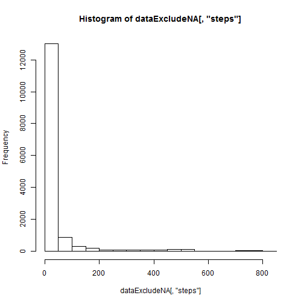
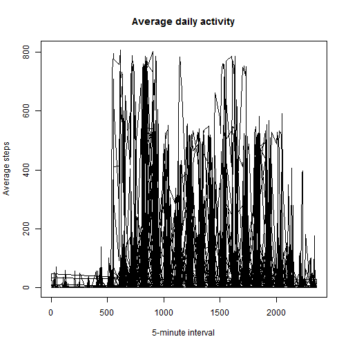
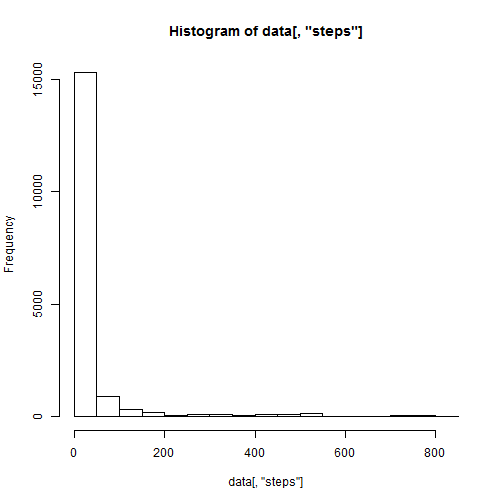

# Reproducible Research : Peer Assessment 1

## Loading and preprocessing the data


```r
data <-read.csv("activity.csv")
dataExcludeNA <- subset(data, steps != "n/a")
dataNAs <- data.frame(subset(data, steps = "n/a"))
```

## What is mean total steps taken per day?

```r
hist(dataExcludeNA[,"steps"])
```

 

```r
meanSteps <- mean(dataExcludeNA[,"steps"])
medianSteps <- median(dataExcludeNA[,"steps"])

print(meanSteps)
```

```
## [1] 37.3826
```

```r
print(medianSteps)
```

```
## [1] 0
```

## What is the average daily activity pattern?

```r
plot(data[,"interval"], data[,"steps"], type="l", xlab="5-minute interval", 
ylab="Average steps",main="Average daily activity")
```

 

## Imputing missing values

### The code will replace N/A values with 0 to account for missing data

```r
print(nrow(dataNAs))
```

```
## [1] 17568
```

```r
data[is.na(dataNAs)] <- 0

hist(data[,"steps"])
```

 

```r
meanSteps <- mean(data[,"steps"])
medianSteps <- median(data[,"steps"])

print(meanSteps)
```

```
## [1] 32.47996
```

```r
print(medianSteps)
```

```
## [1] 0
```

## Are there differences in acitivity patterns between weekdays and weekends?


